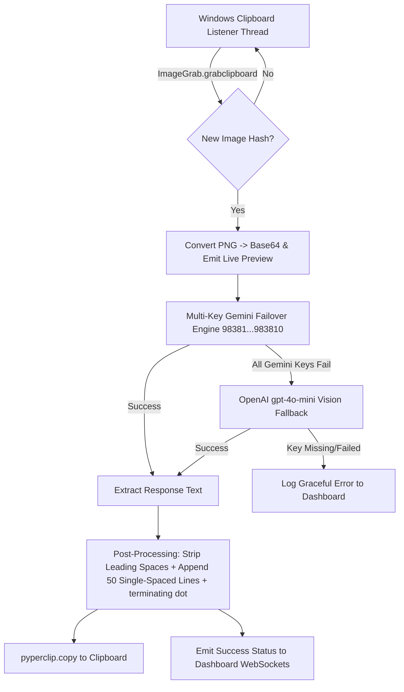

# AI-CONTEXT.md — Textline Project Architecture & Context

This document serves as the primary technical context file for AI agents and developers working on the **Textline** codebase.

---

## 🎯 1. Project Overview

**Textline** is a high-speed Windows desktop clipboard automation tool. When a user captures a screenshot to their Windows clipboard (e.g., via `Win + Shift + S`), Textline automatically:
1. Detects the new image from the system clipboard.
2. Extracts code/text using Google Gemini Vision API (with failover to OpenAI Vision).
3. Post-processes the output to strip leading spaces and append exact padding (50 single-spaced lines + terminating dot `.`).
4. Copies the formatted code directly back to the Windows clipboard.
5. Emits real-time live preview & activity logs to a dark glassmorphism web dashboard over WebSockets.

---

## 🏗️ 2. Architecture & Data Flow



---

## 📄 3. File Index & Core Responsibilities

| File Path | Description | Key Responsibilities |
| :--- | :--- | :--- |
| **[app.py](file:///c:/github/textline/app.py)** | Main Backend Application | Flask-SocketIO server, background clipboard daemon thread, SHA-256 image hashing, multi-key rotation engine, OpenAI fallback, post-processing formatting. |
| **[test_fallback_system.py](file:///c:/github/textline/test_fallback_system.py)** | Test Suite | Automated `unittest` suite testing post-processing padding, 400/404 fail-fast key rotation, and graceful missing OpenAI key handling. |
| **[templates/index.html](file:///c:/github/textline/templates/index.html)** | Frontend UI | Single-page HTML/CSS/JS dashboard, WebSocket status pill, live Base64 image preview, `white-space: pre-wrap` code output container, session history log. |
| **[requirements.txt](file:///c:/github/textline/requirements.txt)** | Dependencies | Packages: `flask`, `flask-socketio`, `pillow`, `pyperclip`, `google-genai`, `openai`. |
| **[.env](file:///c:/github/textline/.env)** | Local Environment Config | Defines `GEMINI_API_KEY_98381`..`983810` and `OPENAI_API_KEY`. |
| **[app.spec](file:///c:/github/textline/app.spec)** | PyInstaller Manifest | PyInstaller bundle specification for building `dist/app.exe`. |

---

## 🔑 4. Multi-Provider & Multi-Key Rotation Engine

The application implements a structured key mapping in `app.py`:

```python
API_KEYS_MAP = {
    "98381": os.environ.get("GEMINI_API_KEY_98381", ...),
    "98382": os.environ.get("GEMINI_API_KEY_98382", ...),
    "98383": os.environ.get("GEMINI_API_KEY_98383", ...),
    "98385": os.environ.get("GEMINI_API_KEY_98385", ...),
    "98386": os.environ.get("GEMINI_API_KEY_98386", ...),
    "98387": os.environ.get("GEMINI_API_KEY_98387", ...),
    "98388": os.environ.get("GEMINI_API_KEY_98388", ...),
    "98389": os.environ.get("GEMINI_API_KEY_98389", ...),
    "983810": os.environ.get("GEMINI_API_KEY_983810", ...)
}
```

### Rotation Rules:
1. **Fail-Fast (400/403/404)**: If a key returns an authentication error, invalid key, or restricted model access (`400 INVALID_ARGUMENT`, `403 PERMISSION_DENIED`, `404 NOT_FOUND`), the rotation engine immediately skips that key without retrying redundant models.
2. **Quota Retry (429)**: If a key hits `429 RESOURCE_EXHAUSTED` (e.g. 20 requests/day limit on Gemini free tier), it failovers to the next Key ID sequentially.
3. **OpenAI Fallback**: If all Gemini keys fail, it calls OpenAI `gpt-4o-mini` with base64 vision payload. If `OPENAI_API_KEY` is not configured, it logs a clean warning without crashing.

---

## 📝 5. Post-Processing Text Formatting Rule

The system prompt sent to the LLM is kept clean:
```text
give me complete code in the given language,
make sure -
1. my code should be very fast in terms of speed.
2. remove any spaces from the starting of each line in the code.

Most important -- I don't need any explanation or any other content, not even a single irrelevant word. The output should be only the code.
```

The output text padding is enforced strictly in Python before copying:
```python
def format_clipboard_output(raw_answer):
    clean_code = raw_answer.lstrip() if raw_answer else "No text returned from model."
    return clean_code + "\n" + "\n".join([" "] * 50) + "\n."
```

---

## 🛠️ 6. Useful Commands

### Run Automated Unit Tests:
```bash
python test_fallback_system.py
# or
python -m unittest -v test_fallback_system.py
```

### Run Locally:
```bash
python app.py
```

### Build Standalone Executable (`dist/app.exe`):
```bash
python -m PyInstaller --noconsole --onefile --icon=textline_logo.ico --add-data "templates;templates" app.py
```
