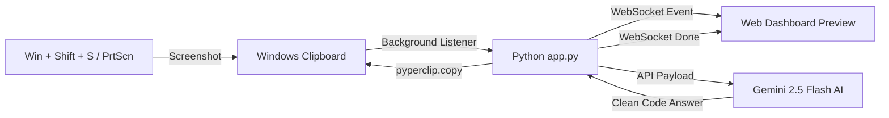

<div align="center">

  

  # ⚡ Textline AI

  **Windows Clipboard to Gemini AI Automation & Real-Time Dashboard**

  [](https://www.python.org/)
  [](https://flask.palletsprojects.com/)
  [](https://ai.google.dev/)
  [](#)
  [](#)

  <p align="center">
    An intelligent, ultra-fast productivity tool that continuously monitors your Windows clipboard for screenshots, analyzes them using <b>Gemini 2.5 Flash</b>, auto-copies clean code or answers back to your clipboard instantly, and visualizes live progress on a glassmorphism web dashboard.
  </p>

</div>

---

## 🌟 Key Features

- 📸 **Zero-Click Clipboard Monitor**: Automatically detects new screenshots taken via `Win + Shift + S` or `PrtScn` every second.
- 🤖 **Gemini 2.5 Flash AI Engine**: Leverages Google's latest official `google-genai` SDK for blazing-fast vision analysis and code generation.
- ⚡ **Instant Clipboard Response**: Direct solutions/code are automatically copied right back to your system clipboard without touching a button.
- 📡 **Real-Time WebSocket Dashboard**: Embedded Flask-SocketIO live control panel featuring dark mode, glassmorphism UI, image previews, status indicators, and session history logs.
- 📦 **Standalone Executable**: Readily packaged into a portable, windowless `.exe` with `PyInstaller` and custom application icon.

---

## 🛠️ Architecture & Workflow



---

## 📂 Project Structure

```text
textline/
├── app.py                  # Main Flask-SocketIO backend & background listener
├── requirements.txt        # Python dependencies
├── textline_logo.jpg       # Project logo image
├── textline_logo.ico       # Icon file for PyInstaller executable build
├── .env                    # Environment variables file (API Keys)
├── .gitignore              # Git ignore configuration
└── templates/
    └── index.html          # WebSockets live control panel dashboard UI
```

---

## 🚀 Quick Start & Setup

### 1. Clone the Repository
```bash
git clone https://github.com/aashishrajput9838/textline.git
cd textline
```

### 2. Install Dependencies
```bash
pip install -r requirements.txt
```

### 3. Configure Gemini API Key
Create a `.env` file in the project root:
```env
GEMINI_API_KEY=your_gemini_api_key_here
```

### 4. Run the Development Server
```bash
python app.py
```
Open your browser and navigate to `http://127.0.0.1:5000` to view the live dashboard!

---

## 📦 Building Standalone Executable (.exe)

You can package Textline into a portable, windowless Windows executable (`app.exe`) using PyInstaller:

```powershell
python -m PyInstaller --noconsole --onefile --icon=textline_logo.ico --add-data "templates;templates" app.py
```

The generated executable will be saved in the `dist/` directory (`dist/app.exe`).

---

## 📄 License

Distributed under the MIT License. See `LICENSE` for more information.

---

<div align="center">
  <sub>Built with ❤️ using Python, Flask-SocketIO, and Google Gemini AI.</sub>
</div>
